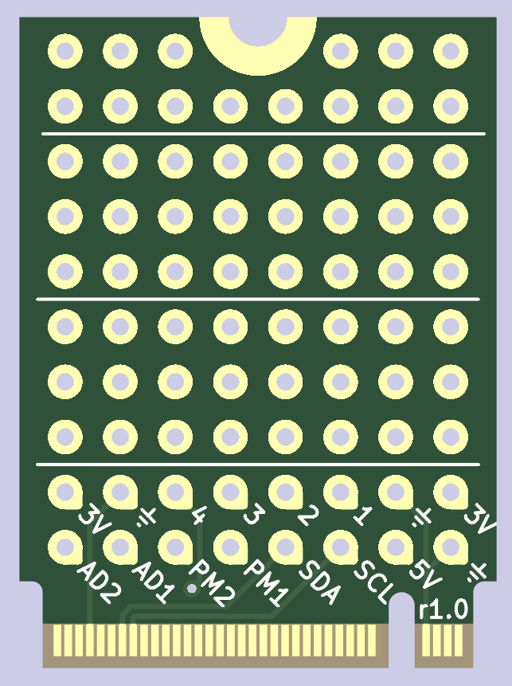
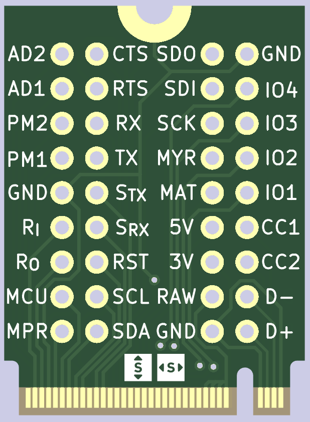

# Myriad Example projects
Having trouble getting started with your Myriad project? Why not [take a look](https://github.com/splitkb/myriad/archive/refs/heads/main.zip) at these example projects to get an idea of what the end result should look like.

_(Having trouble finding this directory in the ZIP? It's under `assets/kicad`!)_

## protoboard_??x??

Simple prototyping board. Exposes basic GPIO functionality on the bottom two rows, while providing 3-long strips on the rest of the card. You can use this to build your own simple modules, without having to get a PCB manufactured.

## breakout_22x30

Breakout board. Exposes all currently-available Myriad pins, making it ideal if you want to try connecting external hardware to it.

## Licensing

These files are available for **non-commercial use only**. See [https://myriad.splitkb.com/specification/terms_of_use.html](https://myriad.splitkb.com/specification/terms_of_use.html) for more information.

## More information

Are you looking for the specification, or just want to know more about the Myriad system in general? Visit [https://myriad.splitkb.com/](https://myriad.splitkb.com/)!
