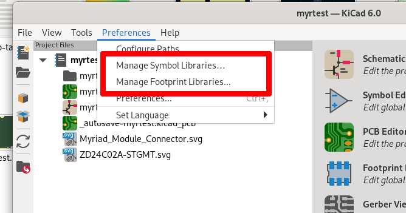

# Symbols & Footprints

The Myriad system uses a relatively complicated form factor. Especially the edge connector isn't a lot of fun to model.

Luckily, you don't have to! If you're using KiCad, we have created all the required files for you. Just [download this repository](https://github.com/splitkb/myriad/archive/refs/heads/main.zip), add `footprints/` as a footprint library and `symbols/myriad.kycad_sym` as a symbol library, and you're good to go.

_(Having trouble finding this directory in the ZIP? It's under `assets/kicad`!)_

## Symbols
### Myriad_Module_Connector

This is probably the most important symbol for you: the Myriad module itself. All connections are grouped by purpose.  To figure out how they are supposed to be used, see the [Electrical Specification](https://myriad.splitkb.com/specification/electrical.html) and [Pinout](https://myriad.splitkb.com/specification/pinout.html) for more information. 

They can be paired with the [Myriad_Module_??x??mm](#myriad_module_xmm) and [Myriad_Module_Edge](#myriad_module_edge) footprints.

### Myriad_Keyboard_Connector
It's essentially the same as Myriad_Module_connector, but from the keyboard side. We just flipped the inputs and outputs.

You can use it together with the [Myriad_Socket](#myriad_socket) footprint.

### ZD24C02A-STGMT

The [Zetta ZD24CxxA](https://www.lcsc.com/product-detail/EEPROM_Zetta-ZD24C08A-STGMT_C2896640.html) is a cheap generic I2C EEPROM which can be used for [card identification](https://myriad.splitkb.com/specification/card_identification/). 

It uses the regular KiCad-provided SOT-23-5 footprint.

Don't feel forced to use this *specific* EEPROM chip - we chose this one for our products because it is cheap and widely available. Did you find a different one? Make sure to compare the [datasheets](https://datasheet.lcsc.com/lcsc/2109141830_Zetta-ZD24C08A-STGMT_C2896640.pdf) for compatibility.

## Footprints
### Myriad_Module_??x??mm

Premade module footprints including the connector and relevant edge cuts are available for the [common module dimensions](https://myriad.splitkb.com/specification/physical.html). They use the [Myriad_Module_Connector](#myriad_module_connector) symbol.

### Myriad_Module_Edge

If you're making a module which does not follow the standard sizing edge cuts, we also provide a separate footprint for just the edge connector. This also uses the [Myriad_Module_Connector](#myriad_module_connector) symbol.

Don't forget to add the plated through-hole for screwing it down, and keep the [keepout area](https://myriad.splitkb.com/specification/physical.html#keepout-areas) in mind!

### Myriad_Graphic_{Length/Width}-{S/M/L}

These markers can be placed on the module to indicate the standard size they are using. 

### Myriad_Socket

If you're designing a Myriad-compatible keyboard, you can use this footprint to easily get the right dimensions. It is built around the [Myriad_Keyboard_Connector](#myriad_keyboard_connector) footprint and uses the [TE Connectivity 2199230-8](https://octopart.com/2199230-8-te+connectivity-46436158) connector.

It comes with a Myriad logo, outlines of the Small & Medium cards on the `User.Drawings` layer, and offset markers for the `Myriad_Socket_Standoff` footprints.

### Myriad_Socket_Standoff_??mm

Used in combination with the `Myriad_Socket` footprint's `2199230-8`, they mount [Wurth Elektronic 9774025151R](https://octopart.com/9774025151r-wurth+elektronik-59774856) SMD screw standoffs.

Place only the 30mm one for Small cards, and use both 30mm and 40mm for Medium cards and above. If the marker on the `User.Drawings` layer matches up with the +00 line of the Myriad_Socket footprint, they are in the right spot.

## Licensing

See [https://myriad.splitkb.com/specification/terms_of_use.html](https://myriad.splitkb.com/specification/terms_of_use.html).

## More information

Are you looking for the specification, or just want to know more about the Myriad system in general? Visit [https://myriad.splitkb.com/](https://myriad.splitkb.com/)!
