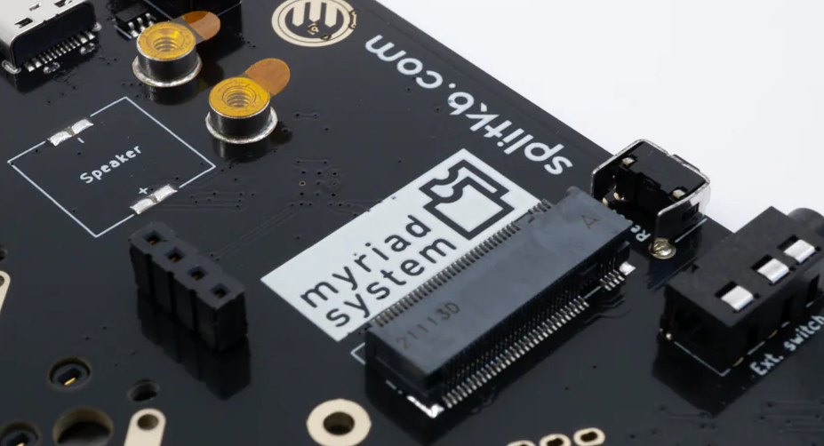

# Specifications
The Myriad system is exhaustively described in [the specifications](specification/).

# Symbols & Footprints
In order to save you some time, we have already created the necessary KiCad footprints and symbols for you. You can find them [here](https://github.com/splitkb/myriad/tree/main/assets/kicad).

# Example projects
Prefer looking at ready-made cards to get a feel of it? Why not take a look at [these](https://github.com/splitkb/myriad/tree/main/assets/example_projects)?
